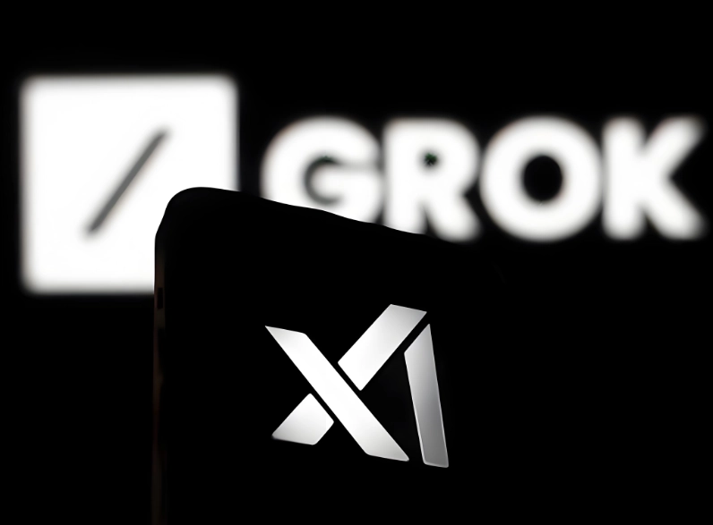

# Grok下载注册使用全攻略：5分钟上手AI助手

---

你是不是听说Grok很强大，但不知道怎么下载？或者下载完了不会注册？别担心，这篇文章就是专门给你准备的。我会用最直白的语言，告诉你怎么在手机上下载Grok，怎么注册账号，以及一些你可能会遇到的小坑。

如果你只是想快速体验Grok的强大功能，但又不想折腾下载注册这些繁琐步骤，👉 [直接用成品号马上开始使用，省去所有麻烦](https://shaoyumi.com/buy/66)，这可能是最省心的办法。

---

## 先说说Grok是什么东西

Grok是马斯克的xAI团队搞出来的AI助手。2023年11月上线，现在已经更新到Grok 4了。它能干什么？聊天、写代码、生成图片，基本上你能想到的AI功能它都有。

最关键的是，它和其他AI不太一样——Grok的回答更"真实"，更有个性，不会像某些AI那样说话像个客服机器人。而且它和X（就是以前的Twitter）深度绑定,能实时获取社交平台上的最新信息。

## Grok官方地址在哪里

- **网页版**：https://grok.com/ （直接在浏览器打开就能用）
- **xAI官网**：https://x.ai/ （了解更多技术细节）
- **X平台入口**：在X里搜"Grok"，会有专门的选项卡

## 手机上怎么下载Grok

### iPhone用户（iOS版）

2025年1月9日，Grok的iOS应用在美国App Store上线了。现在逐步覆盖到全球市场。

**下载步骤：**

1. 打开你的App Store
2. 点底下的"搜索"
3. 输入"Grok"或"Grok AI"
4. 找到开发商是xAI的那个应用
5. 点"获取"，等下载完
6. 打开后会让你绑定X账号，按提示来就行

**如果你所在地区还没开放怎么办？** 用美国的Apple ID登录App Store就能下载。网上有很多教程教你怎么注册美区ID，这里就不展开了。

### 安卓用户

Grok安卓版在2025年2月4日开始测试，7月份基本全球都能用了。

**方法一：Google Play下载（推荐）**

1. 打开Google Play商店
2. 搜"Grok"或"Grok AI"
3. 如果显示"安装"就直接装；如果是"预注册"就先预约，等正式版推送
4. 装好后打开，登录就能用

**方法二：下载APK文件（Google Play装不了的话）**

有时候因为地区限制，Google Play里找不到Grok。这时候可以去这些网站下载APK文件：

- **Uptodown**：搜"Grok for Android Uptodown"，下载最新版
- **APKPure**：搜"ai.x.grok.apk"

**装APK的步骤：**

1. 下载APK文件到手机
2. 去设置里允许"安装未知来源应用"
3. 点APK文件，按提示安装
4. 打开Grok，登录账号

## 怎么注册Grok账号

下载完了，接下来就是注册。其实很简单：

1. **准备账号**：Grok需要绑定X账号、iOS账号或Google账号。没有X账号的话，先去注册一个。
2. **打开Grok应用或网页**
3. **点"Sign In"或"使用X登录"**
4. **授权绑定**：按照提示完成和X账号的关联
5. **选择套餐**：免费版能体验基础功能，想要更多额度和高级功能，可以订阅Premium+或Super Grok会员

如果你觉得注册流程太麻烦，或者X账号注册不了（国内用户都懂的），👉 [直接买个成品号，几分钟就能开始用Grok](https://shaoyumi.com/buy/66)，不用折腾那些繁琐的步骤。

## 一些使用小提示

- **Grok的风格**：它回答问题比较直接，有时候还会开玩笑。别指望它像ChatGPT那样"温柔"。
- **图像生成**：Grok能生成图片,但质量和风格跟其他AI工具不太一样，值得试试。
- **实时信息**：因为它和X绑定，能获取最新的社交动态和新闻，这是其他AI做不到的。

---

## 总结一下

Grok的下载和注册其实不复杂：iPhone用户去App Store搜，安卓用户去Google Play或下载APK，注册时绑定X账号就行。

如果你想快速体验Grok的功能，又不想在下载注册上浪费时间，直接用成品号是最高效的选择——省去所有折腾，几分钟就能开始使用。想了解更多关于[Grok Super会员成品号的信息，点这里](https://shaoyumi.com/buy/66)。

希望这篇文章能帮到你。如果你在使用过程中遇到什么问题,欢迎留言交流。
